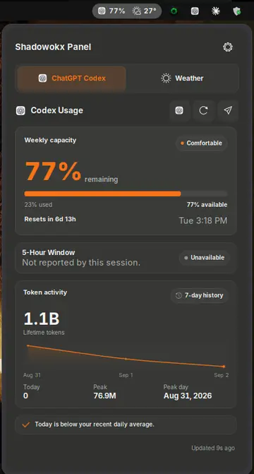
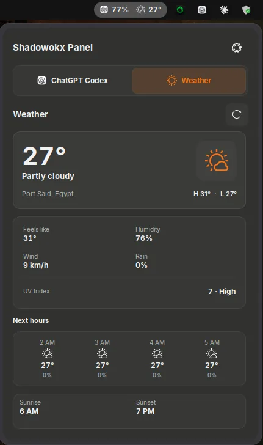

# Shadowokx Panel

A lightweight GNOME Shell panel for checking Codex usage and local weather from one place.

Release `2.3.3`.

## Download for Windows 11

### [Download the latest Windows Setup (x64)](https://github.com/SHADOWOKX/SHADOWOKX-PANEL/releases/latest/download/ShadowokxPanel-Setup-x64.exe)

The Windows installer is self-contained, installs for the current user, and does not require Visual Studio, the .NET SDK, or administrator privileges. Windows may show an **Unknown publisher** or Microsoft Defender SmartScreen warning while community releases are unsigned.

- [View all releases and checksums](https://github.com/SHADOWOKX/SHADOWOKX-PANEL/releases)
- [Windows source and documentation](https://github.com/SHADOWOKX/SHADOWOKX-PANEL/tree/windows-port)

The `main` branch remains the Linux/GNOME implementation. The native Windows implementation is maintained separately on `windows-port`.

## Screenshots

<p align="center">
  
  
</p>

## Features

- Codex weekly and five-hour limits
- Token activity and seven-day history
- Local weather, UV, hourly forecast, and sunrise/sunset
- Custom themes, colors, density, and panel width
- Cached data during temporary connection failures
- No telemetry or analytics

## Requirements

- Ubuntu 26.04.1 LTS
- GNOME Shell 50.x
- Wayland
- GJS 1.88 or newer
- Git

## Install on Linux

### Quick install

Copy and paste this into a terminal:

```bash
git clone https://github.com/SHADOWOKX/SHADOWOKX-PANEL.git && cd SHADOWOKX-PANEL && ./install.sh
```

When the installer finishes, **log out and back in once** so GNOME Shell can load the extension.

Then enable it:

```bash
gnome-extensions enable shadow-panel@shadowokx
```

That's it. Shadowokx Panel should now appear in the GNOME top bar.

### Open preferences

```bash
gnome-extensions prefs shadow-panel@shadowokx
```

## Update

If you installed the panel with the command above, update it with:

```bash
cd SHADOWOKX-PANEL
git pull
./install.sh
```

Then log out and back in once to load the updated version. If needed, enable it again with:

```bash
gnome-extensions enable shadow-panel@shadowokx
```

## Uninstall

From the cloned `SHADOWOKX-PANEL` directory:

```bash
./uninstall.sh
```

## Development

Run the project checks:

```bash
./scripts/check.sh
```

Build the installable package:

```bash
./scripts/package.sh
```

## Privacy

Shadowokx Panel uses the signed-in local Codex client for usage data and Open-Meteo for weather. It does not read Codex credentials or include telemetry.

## Contributors

- [SHADOWOKX](https://github.com/SHADOWOKX) — creator and maintainer

## License

GPL-3.0-or-later. See [LICENSE](LICENSE).
