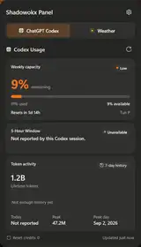
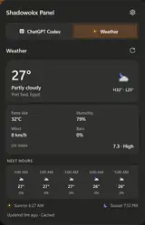

# Shadowokx Panel

A lightweight cross-platform panel for checking **ChatGPT Codex usage** and **local weather** from one place.

- Weekly and 5-hour Codex limits
- Token activity and history
- Local weather and hourly forecast
- Native Linux and Windows interfaces
- No telemetry or analytics

## Windows 11

### [Download the latest Windows Setup (x64)](https://github.com/SHADOWOKX/SHADOWOKX-PANEL/releases/latest/download/ShadowokxPanel-Setup-x64.exe)

Download the Setup, open it, and install. It is self-contained and does not require the .NET SDK, Visual Studio, or administrator privileges.

<p align="center">
  
  
</p>

<p align="center">
  
</p>

> The current Windows build is unsigned, so SmartScreen may show an **Unknown publisher** warning.

[Windows source and documentation](https://github.com/SHADOWOKX/SHADOWOKX-PANEL/tree/windows-port)

## Linux (GNOME)

Tested on Ubuntu 26.04.1, GNOME Shell 50 and Wayland.

```bash
git clone https://github.com/SHADOWOKX/SHADOWOKX-PANEL.git
cd SHADOWOKX-PANEL
./install.sh
```

Log out and back in once, then enable the extension:

```bash
gnome-extensions enable shadow-panel@shadowokx
```

## Privacy

Shadowokx Panel uses the signed-in local Codex client for usage data and Open-Meteo for weather. It does not read Codex credentials or include telemetry.

## License

GPL-3.0-or-later. See [LICENSE](LICENSE).
