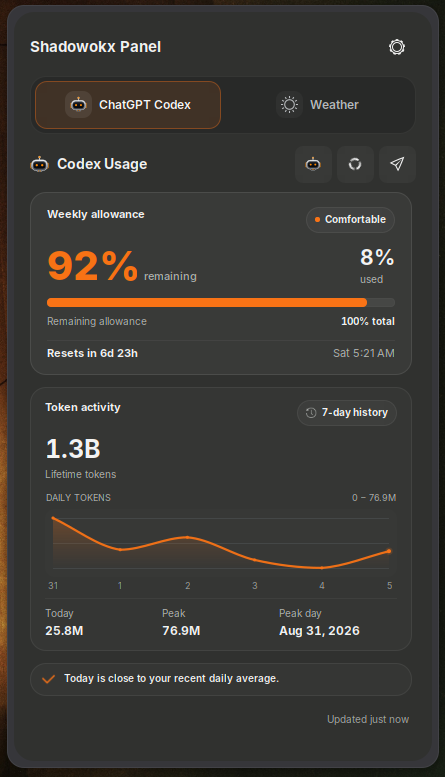
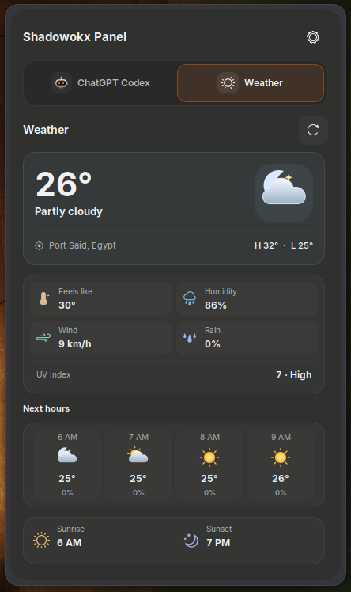

# Shadowokx Panel

A lightweight cross-platform panel for checking **ChatGPT Codex usage** and **local weather** from one place.

Linux `2.3.3` · Windows `1.0.0`.

- Weekly and 5-hour Codex limits
- Original Shadowokx mascot with idle, awake, and active states
- Token activity and seven-day history
- Local weather, UV, hourly forecast, and sunrise/sunset
- Native Linux and Windows interfaces
- Custom themes, colors, density, and panel width
- Cached data during temporary connection failures
- No telemetry or analytics

## Linux (GNOME)

Tested on Ubuntu 26.04.1 LTS, GNOME Shell 50.x and Wayland.

### Screenshots

#### Codex usage

<p align="center">
  <a href="assets/linux-codex-v2.png">
    
  </a>
</p>

#### Weather

<p align="center">
  <a href="assets/linux-weather-v2.png">
    
  </a>
</p>

#### GNOME top bar

<p align="center">
  <a href="assets/linux-tray.png">
    
  </a>
</p>

### Requirements

- Ubuntu 26.04.1 LTS
- GNOME Shell 50.x
- Wayland
- GJS 1.88 or newer
- Git

### Quick install

```bash
git clone https://github.com/SHADOWOKX/SHADOWOKX-PANEL.git && cd SHADOWOKX-PANEL && ./install.sh
```

When the installer finishes, **log out and back in once** so GNOME Shell can load the extension.

Then enable it:

```bash
gnome-extensions enable shadow-panel@shadowokx
```

### Open preferences

```bash
gnome-extensions prefs shadow-panel@shadowokx
```

### Update

```bash
cd SHADOWOKX-PANEL
git pull
./install.sh
```

Then log out and back in once to load the updated version. If needed, enable it again with:

```bash
gnome-extensions enable shadow-panel@shadowokx
```

### Uninstall

```bash
./uninstall.sh
```

## Windows 11

### [Download the latest Windows Setup (x64)](https://github.com/SHADOWOKX/SHADOWOKX-PANEL/releases/latest/download/ShadowokxPanel-Setup-x64.exe)

Download the Setup, open it, and install. It is self-contained and does not require the .NET SDK, Visual Studio, or administrator privileges.

### Screenshots

#### Codex usage

<p align="center">
  <a href="assets/windows-codex.png">
    
  </a>
</p>

#### Weather

<p align="center">
  <a href="assets/windows-weather.png">
    
  </a>
</p>

#### Windows system tray

<p align="center">
  <a href="assets/windows-tray.png">
    
  </a>
</p>

> The current Windows build is unsigned, so SmartScreen may show an **Unknown publisher** warning.

[Windows source and documentation](https://github.com/SHADOWOKX/SHADOWOKX-PANEL/tree/windows-port)

## Privacy

Shadowokx Panel uses the signed-in local Codex client for usage data and Open-Meteo for weather. The extension does not read Codex credentials and does not include telemetry or analytics.

The mascot watches local Codex session-file notifications and reads only appended event records to identify work activity; it does not retain prompt or response content.

Weather data is provided by [Open-Meteo.com](https://open-meteo.com/) under its [CC BY 4.0 data licence](https://open-meteo.com/en/license). Open-Meteo service terms and privacy information are available [here](https://open-meteo.com/en/terms).

## Code signing policy

Windows releases follow the project's documented code-signing process.

See [CODE_SIGNING_POLICY.md](CODE_SIGNING_POLICY.md).

Free code signing provided by SignPath.io, certificate by SignPath Foundation.

## Development

Run the project checks:

```bash
./scripts/check.sh
```

Build the installable package:

```bash
./scripts/package.sh
```

## Contributors

- [SHADOWOKX](https://github.com/SHADOWOKX) — creator and maintainer

## License

GPL-3.0-or-later. See [LICENSE](LICENSE).
